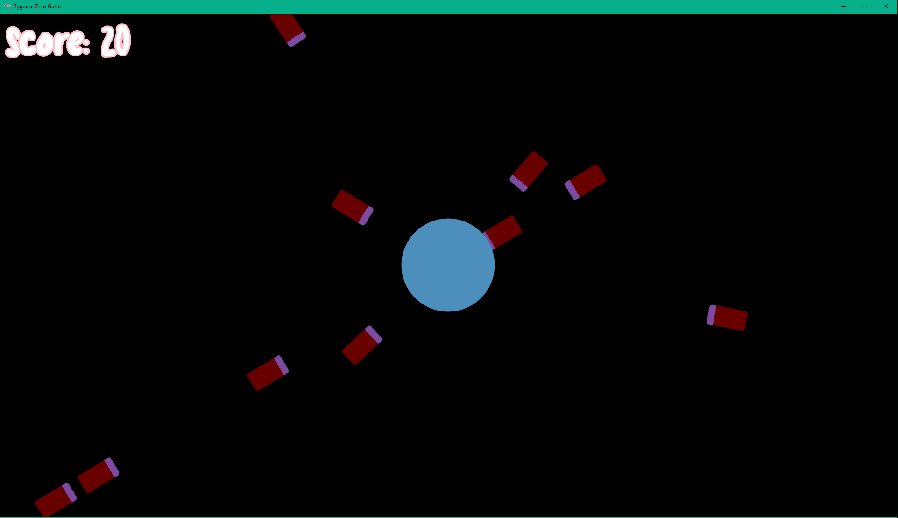

# Click Defense

Click Defense is a beginner-friendly mouse-based game where you defend a central base by clicking incoming enemies before they reach the center. This project was built as a practice game for a game jam.
## Features

- Minimal, functional gameplay: click enemies before they reach your base
- Simple game loop:  Enemy approaches base→ Player clicks enemy → Enemy disappears → Score increases → Repeat → Game over if enemy reaches base→ Option to restart.
- Score tracking for player feedback
- Structured for easy expansion and learning

## Project Status

Status: In active development (Game Jam WIP).

Current:
- Core Mechanics:
    - Player clicks enemy > Enemy disappears
    - Score increases per enemy destroyed.
    - Game pauses if enemy reaches target.
- Features:
    - Multiple enemies spawn and approach target.
    - Difficulty scaling - spawn frequency based on score
    - Score display


Planned next:
- Start screen
- Game start control
- Game over screen
- Restart capability

## Screenshots

**Gameplay**



## Installation

1. Clone or download this repository.
2. Navigate to the project folder: cd path\to\project\folder
3. Use **Python 3.12**
4. Create a virtual environment (if you haven't already): python -m venv venv
5. Activate the virtual environment:
- On Windows:
  ```
  venv\Scripts\activate
  ```
- On macOS/Linux:
  ```
  source venv/bin/activate
  ```
6. Install dependencies: pip install -r requirements.txt

## How to Run

1. Make sure your virtual environment is active.
2. In your terminal run **pgzrun main.py** in your terminal.
3. The game window will open and start at the main menu. Click "Start" to play.

## Controls

- **Mouse Left Click**: Click on enemies to destroy them
- **Buttons**: Start game, restart game, quit game

## Project Structure

## Notes / Learning Goals

This project focuses on:
- Structuring a beginner Python game using Pygame Zero
- Implementing a simple game loop
- Handling game states and UI button interactions
- Practicing Python OOP concepts in a fun project
